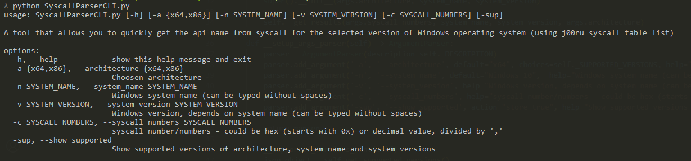
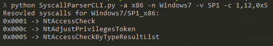
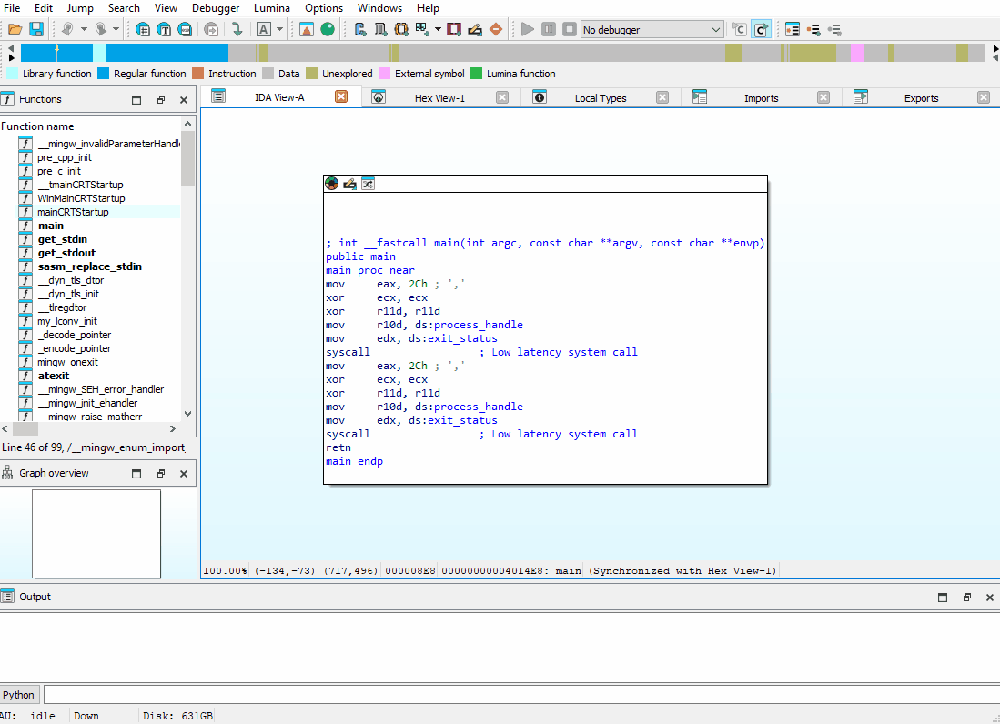

# Syscall Parser 

A tool that allows you to quickly get the Windows api name from syscall number for the selected version of Windows operating system (using j00ru syscall table list). You can use a standalone Python script or add this tool to IDA Pro. The script uses "nt-per-system.json" files, which are stored in folders correlated with their architecture.

## Command line utility

In order to use the CLI tool, run the script "SyscallParserCLI.py" from the "CLI" folder with predefined arguments. Running without arguments or with invalid ones will present the correct options for using the tool.

|  |
|:--:|
| *Prompt of CLI tool* |

|  |
|:--:|
| *Example run CLI tool* |

## IDA Pro plugin

In order to use the plug-in for IDA Pro, copy the "syscall_parser_IDA.py" file and the "SyscallParser" folder to the location where the IDA Pro plugins are located (e.g. "\AppData\Hex-Rays\IDA Pro\plugins"). Then initialize the tool's configurations in IDA Pro using the user window form from the "Edit/Plugins/Syscall Parser Config" location.  After pointing where to insert the syscall name, right-click and select "Syscall Parser" from the menu, after which indicate whether it should be a comment or an enum.

|  |
|:--:|
| *Usage of IDA Pro plugin* |

## Dependencies

j00ru syscall table list - https://github.com/j00ru/windows-syscalls